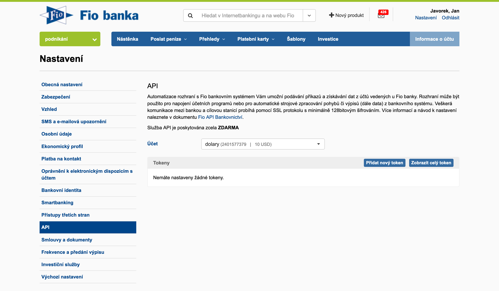

fiobank
=======

`Fio Bank API <http://www.fio.cz/bank-services/internetbanking-api>`_
in Python.

Installation
------------

From PyPI::

    pip install fiobank

In case you have an adventurous mind, give a try to the source::

    pip install git+https://github.com/honzajavorek/fiobank.git#egg=fiobank

Usage
-----

First, get your API token.

Initialization of the client:

.. code:: python

    >>> from fiobank import FioBank
    >>> client = FioBank(token='...', decimal=True)

Account information:

.. code:: python

    >>> client.info()
    {
      'currency': 'CZK',
      'account_number_full': 'XXXXXXXXXX/2010',
      'balance': Decimal('42.00'),
      'account_number': 'XXXXXXXXXX',
      'bank_code': '2010'
    }

Listing transactions within a period:

.. code:: python

    >>> gen = client.period('2013-01-20', '2013-03-20')
    >>> list(gen)[0]
    {
      'comment': 'N\xe1kup: IKEA CR, BRNO, CZ, dne 17.1.2013, \u010d\xe1stka  2769.00 CZK',
      'recipient_message': 'N\xe1kup: IKEA CR, BRNO, CZ, dne 17.1.2013, \u010d\xe1stka  2769.00 CZK',
      'user_identification': 'N\xe1kup: IKEA CR, BRNO, CZ, dne 17.1.2013, \u010d\xe1stka  2769.00 CZK',
      'currency': 'CZK',
      'amount': Decimal('-2769.0'),
      'instruction_id': 'XXXXXXXXXX',
      'executor': 'Vilém Fusek',
      'date': datetime.date(2013, 1, 20),
      'type': 'Platba kartou',
      'transaction_id': 'XXXXXXXXXX'
    }

Getting transactions with account information in one request:

.. code:: python

   >>> client.transactions('2013-01-20', '2013-03-20')
   (
      {'currency': 'CZK', 'account_number_full': 'XXXXXXXXXX/2010', 'balance': 42.00, 'account_number': 'XXXXXXXXXX', 'bank_code': '2010'}, 
      'transactions': <generator object _parse_transactions at 0x170c190>
   )

Listing transactions from a single account statement:

.. code:: python

    >>> client.statement(2013, 1)  # 1 is January only by coincidence - arguments mean 'first statement of 2013'

Listing the latest transactions:

.. code:: python

    >>> client.last()  # return transactions added from last listing
    >>> client.last(from_id='...')  # sets cursor to given transaction_id and returns following transactions
    >>> client.last(from_date='2013-03-01')  # sets cursor to given date and returns following transactions
    
Getting the latest transactions with account information in one request:

.. code:: python

   >>> client.last_transactions()
   (
      {'currency': 'CZK', 'account_number_full': 'XXXXXXXXXX/2010', 'balance': 42.00, 'account_number': 'XXXXXXXXXX', 'bank_code': '2010'}, 
      'transactions': <generator object _parse_transactions at 0x170c190>
   )

Conflict Error
--------------

`Fio API documentation <http://www.fio.cz/docs/cz/API_Bankovnictvi.pdf>`_
(Section 8.3) states that a single token should be used only once per
30s. Otherwise, an HTTP 409 Conflict will be returned and
``fiobank.ThrottlingError`` will be raised.

Development
-----------

Install using `uv <https://docs.astral.sh/uv/>`_::

    git clone git@github.com:honzajavorek/fiobank.git
    cd fiobank
    uv sync

Then run tests::

    uv run pytest

License: ISC
------------

© 2025 Honza Javorek <mail@honzajavorek.cz>

This work is licensed under the `ISC
license <https://en.wikipedia.org/wiki/ISC_license>`_.
