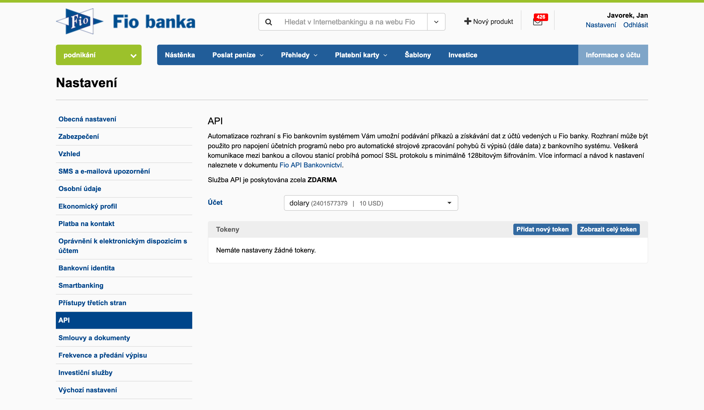

fiobank
=======

`Fio Bank API <http://www.fio.cz/bank-services/internetbanking-api>`_
in Python.

Installation
------------

From PyPI::

    pip install fiobank

In case you have an adventurous mind, give a try to the source::

    pip install git+https://github.com/honzajavorek/fiobank.git#egg=fiobank

Usage
-----

First, get your API token.

Initialization of the client:

.. code:: python

    >>> from fiobank import FioBank
    >>> client = FioBank(token='...', decimal=True)

Account information:

.. code:: python

    >>> client.info()
    {
      'currency': 'CZK',
      'account_number_full': 'XXXXXXXXXX/2010',
      'balance': Decimal('42.00'),
      'account_number': 'XXXXXXXXXX',
      'bank_code': '2010'
    }

Listing transactions within a period:

.. code:: python

    >>> gen = client.period('2013-01-20', '2013-03-20')
    >>> list(gen)[0]
    {
      'comment': 'N\xe1kup: IKEA CR, BRNO, CZ, dne 17.1.2013, \u010d\xe1stka  2769.00 CZK',
      'recipient_message': 'N\xe1kup: IKEA CR, BRNO, CZ, dne 17.1.2013, \u010d\xe1stka  2769.00 CZK',
      'user_identification': 'N\xe1kup: IKEA CR, BRNO, CZ, dne 17.1.2013, \u010d\xe1stka  2769.00 CZK',
      'currency': 'CZK',
      'amount': Decimal('-2769.0'),
      'instruction_id': 'XXXXXXXXXX',
      'executor': 'Vilém Fusek',
      'date': datetime.date(2013, 1, 20),
      'type': 'Platba kartou',
      'transaction_id': 'XXXXXXXXXX'
    }

Getting transactions with account information in one request:

.. code:: python

    >>> info, transactions = client.transactions('2013-01-20', '2013-03-20')
   (
      {'currency': 'CZK', 'account_number_full': 'XXXXXXXXXX/2010', 'balance': 42.00, 'account_number': 'XXXXXXXXXX', 'bank_code': '2010'},
        <generator object _parse_transactions at 0x170c190>
   )

Listing transactions from a single account statement:

.. code:: python

    >>> client.statement(2013, 1)  # 1 is January only by coincidence - arguments mean 'first statement of 2013'

Listing transactions from the last (most recent) account statement:

.. code:: python

    >>> client.last_statement()  # transactions of the last statement
    >>> client.last_statement(2013)  # transactions of the last statement of 2013

This resolves the most recent statement number (via Fio's undocumented
``lastStatement`` endpoint, also used by the official Fio API Plus application)
and returns its transactions, just like ``statement()``. It raises
``ValueError`` when there's no statement for the given year.

Listing the latest transactions:

.. code:: python

    >>> client.last()  # return transactions added from last listing
    >>> client.last(from_id='...')  # sets cursor to given transaction_id and returns following transactions
    >>> client.last(from_date='2013-03-01')  # sets cursor to given date and returns following transactions

Getting the latest transactions with account information in one request:

.. code:: python

    >>> info, transactions = client.last_transactions()
   (
      {'currency': 'CZK', 'account_number_full': 'XXXXXXXXXX/2010', 'balance': 42.00, 'account_number': 'XXXXXXXXXX', 'bank_code': '2010'},
        <generator object _parse_transactions at 0x170c190>
   )

Async
-----

``AsyncFioBank`` mirrors ``FioBank`` method for method, only the I/O is
awaited. Parsing stays synchronous, so the transaction generators are the
same in both variants -- you just ``await`` the call to get them:

.. code:: python

    >>> from fiobank import AsyncFioBank
    >>> client = AsyncFioBank(token='...', decimal=True)
    >>> info = await client.info()
    >>> transactions = await client.period('2013-01-20', '2013-03-20')
    >>> for transaction in transactions:
    ...     ...

HTTP client
-----------

By default ``FioBank`` talks to the API with `httpx
<https://www.python-httpx.org/>`_ (``httpx.Client``) and ``AsyncFioBank``
with ``httpx.AsyncClient``. Both accept a ``transport=`` argument, so you can
plug in any HTTP client -- ``aiohttp``, ``urllib``, a caching or proxying
layer, or a fake for tests. A transport does exactly one thing: GET a URL and
return a status code plus the raw body bytes.

.. code:: python

    >>> from fiobank import FioBank, Response
    >>>
    >>> class RequestsTransport:
    ...     def __init__(self, timeout=60):
    ...         import requests
    ...         self.timeout = timeout
    ...         self.session = requests.Session()
    ...
    ...     def get(self, url, params=None):
    ...         r = self.session.get(url, params=params, timeout=self.timeout)
    ...         return Response(r.status_code, r.content)
    ...
    >>> client = FioBank(token='...', decimal=True, transport=RequestsTransport())

The synchronous ``Transport`` and asynchronous ``AsyncTransport`` protocols
(both exported from ``fiobank``) describe the single ``get()`` method a custom
transport needs to implement.

Conflict Error
--------------

`Fio API documentation <http://www.fio.cz/docs/cz/API_Bankovnictvi.pdf>`_
(Section 8.3) states that a single token should be used only once per
30s. Otherwise, an HTTP 409 Conflict will be returned.

The client automatically retries throttling errors up to 3 times with
exponential backoff. If all attempts fail,
``fiobank.ThrottlingError`` will be raised.

HTTP Errors
-----------

Any other non-2xx response raises ``fiobank.HTTPError`` (with the API token
redacted from the message). This is transport-independent -- earlier versions
leaked ``requests.HTTPError``, which is exactly what made the HTTP client
impossible to swap out.

Notes
-----

- Use ``decimal=True`` for money-safe ``Decimal`` values. Without it,
    amounts are parsed as ``float``.
- Date arguments accept ``date``, ``datetime``, or ISO-like strings
    (e.g. ``YYYY-MM-DD`` and ``YYYY-MM-DDTHH:MM:SS``).

Development
-----------

Install using `uv <https://docs.astral.sh/uv/>`_::

    git clone git@github.com:honzajavorek/fiobank.git
    cd fiobank
    uv sync

Then run tests::

    uv run pytest

Releasing
---------

Release flow is automated by GitHub Actions in
`.github/workflows/release.yml`.

1. Make sure you have the latest commits::

    git pull

2. Bump the version in `pyproject.toml` using `uv`::

    uv version --bump patch  # or minor / major

3. Review and commit the version change::

    git commit -am "release vX.Y.Z"

4. Create and push a git tag for that version::

    git tag vX.Y.Z
    git push origin HEAD --tags

When the tag appears on GitHub, the release workflow builds and smoke-tests
the package, then publishes it to PyPI automatically (for the
`honzajavorek/fiobank` repository only).

The changelog is maintained in `GitHub Releases <https://github.com/honzajavorek/fiobank/releases>`_.

License: ISC
------------

© 2026 Honza Javorek <mail@honzajavorek.cz>

This work is licensed under the `ISC
license <https://en.wikipedia.org/wiki/ISC_license>`_.
